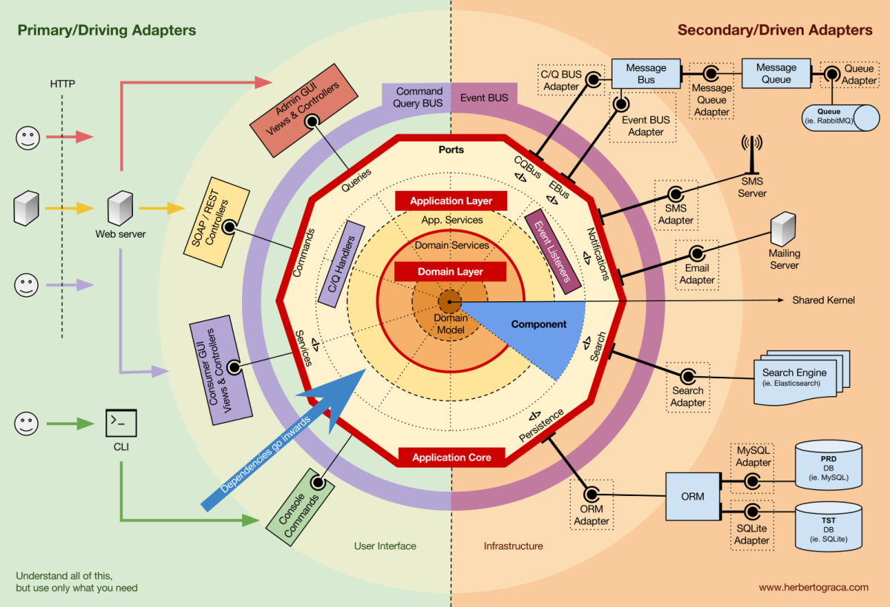

## Python + FastApi + Hexagonal Arc + DDD

### Inspiração: [Augusto Marinho](https://medium.com/@augustomarinho/arquitetura-hexagonal-no-python-ae08b108ac12) e [ShahriyarR](https://github.com/ShahriyarR/hexagonal-fastapi-jobboard)




### Camada Domain:

A camada de **Domain** é o núcleo da aplicação, contendo a lógica de negócios principal e os conceitos centrais. Ela é independente das tecnologias externas e foca apenas nas regras e entidades de negócio.

- **Models:** Define os modelos de dados que representam as entidades principais da aplicação, como usuários, produtos, etc. Esses modelos encapsulam a lógica de negócios e as regras associadas aos dados.


- **Ports:**  Define as interfaces e abstrações que descrevem as operações que a camada de domínio pode realizar, mas sem se preocupar com a implementação. São as portas através das quais a camada de domínio interage com o mundo exterior (como repositórios e unidades de trabalho).


### Camada Application:
A camada de **Application** é responsável por orquestrar a lógica de negócios e fornecer uma interface para os casos de uso do sistema. Ela atua como um intermediário entre a camada de domínio e os adaptadores externos.

- **Schemas:** Contém definições e validações de dados que são usados para comunicação entre a aplicação e o mundo exterior (como APIs). Inclui esquemas para validar entradas e saídas, garantindo que os dados estejam no formato esperado.


- **Use Cases::**  Implementa a lógica específica dos casos de uso da aplicação. Cada caso de uso corresponde a uma operação ou funcionalidade que a aplicação oferece. A camada de aplicação coordena essas operações, garantindo que as regras de negócio sejam seguidas.

### Configurator

O **Configurator** é responsável por fornecer configurações e gerenciar dependências dentro da aplicação. Ele garante que os componentes da aplicação sejam configurados e integrados corretamente.
 
- Common: Inclui utilitários e funções comuns, como hashing e segurança, que são usados em diferentes partes da aplicação.


- Config: Armazena as configurações gerais da aplicação, como variáveis de ambiente e configurações específicas.


- Containers: Gerencia a injeção de dependências, permitindo que diferentes partes da aplicação sejam configuradas e injetadas conforme necessário.


- DB: Configura a conexão e as opções do banco de dados, garantindo que a aplicação possa se comunicar com o banco de dados de forma adequada.

### Ports:
A "camada" de **Ports** define as interfaces e abstrações para os componentes que interagem com a camada de domínio. Ela permite que a camada de domínio permaneça independente das implementações concretas e das tecnologias externas.

- Repositories: Define as interfaces para operações de acesso a dados, como buscar, salvar e atualizar entidades. A camada de domínio usa essas interfaces para interagir com o banco de dados.


- Unit of Works: Define interfaces para gerenciar transações e garantir a consistência dos dados durante as operações de escrita e leitura.

### Adapters:
A "camada" de Adapters (ou Adaptadores) é responsável por conectar a aplicação com o mundo exterior. Ela implementa as interfaces definidas na camada de domínio e permite que a aplicação interaja com diferentes tecnologias e sistemas externos.

- DB: Implementa a persistência de dados, usando ORMs e gerenciando as migrações do banco de dados.


- Entry Points: Contém os pontos de entrada da aplicação, como rotas REST e WebSocket, que permitem que a aplicação receba e envie dados para os clientes e outros sistemas.


- Repositories: Contém as implementações concretas dos repositórios, interagindo diretamente com o banco de dados ou outras fontes de dados.


- Unit of Works: Implementa a lógica para gerenciar transações e garantir que as operações sejam realizadas de maneira atômica e consistente.


- Use Cases: Implementa a lógica para casos de uso específicos, orquestrando interações entre a camada de domínio e os adaptadores.


_Cada uma dessas camadas e componentes desempenha um papel crucial na organização e funcionamento da aplicação, garantindo uma separação clara de responsabilidades e facilitando a manutenção e escalabilidade do código._ 

### Estrutura de Pastas:

```
app                                                       
├─ adapters                                               
│  ├─ db                                                  
│  │  ├─ migrations                                       
│  │  │  ├─ versions                                      
│  │  │  │  ├─ 07246a2dad78_initial_migration.py          # Migração inicial para criar o esquema do banco de dados.
│  │  │  │  ├─ 14e6f5e786af_rename_id_to_uuid.py           # Migração para renomear IDs para UUIDs.
│  │  │  │  ├─ __init__.py                                # Arquivo de inicialização do pacote de migrações.
│  │  │  │  └─ e9533847a2fb_revert_uuid_changes_to_id.py  # Migração para reverter alterações de UUID para IDs.
│  │  │  ├─ __init__.py                                    # Arquivo de inicialização do pacote de migrações.
│  │  │  ├─ env.py                                        # Configuração do ambiente para as migrações do Alembic.
│  │  │  └─ script.py.mako                                # Modelo de script de migração.
│  │  ├─ __init__.py                                      # Arquivo de inicialização do pacote de banco de dados.
│  │  ├─ alembic.ini                                     # Configuração do Alembic para migrações.
│  │  └─ orm.py                                          # Mapeamento ORM para o banco de dados.
│  ├─ entrypoints                                         
│  │  ├─ rest                                             
│  │  │  ├─ v1                                            
│  │  │  │  ├─ login_routes.py                            # Rotas relacionadas ao login.
│  │  │  │  └─ users_routes.py                            # Rotas relacionadas aos usuários.
│  │  │  ├─ __init__.py                                    # Arquivo de inicialização do pacote de rotas REST.
│  │  │  └─ utils.py                                      # Funções utilitárias para rotas REST.
│  │  ├─ ws                                               
│  │  │  └─ __init__.py                                    # Arquivo de inicialização para rotas WebSocket.
│  │  ├─ __init__.py                                      # Arquivo de inicialização do pacote de entrypoints.
│  │  └─ application.py                                   # Configuração e inicialização do aplicativo.
│  ├─ repositories                                        
│  │  ├─ __init__.py                                      # Arquivo de inicialização do pacote de repositórios.
│  │  └─ user_repository_impl.py                          # Implementação do repositório de usuários.
│  ├─ unit_of_works                                       
│  │  ├─ __init__.py                                      # Arquivo de inicialização do pacote de unit of works.
│  │  └─ users_uow_impl.py                                # Implementação da unidade de trabalho para usuários.
│  ├─ use_cases                                           
│  │  ├─ __init__.py                                      # Arquivo de inicialização do pacote de casos de uso.
│  │  └─ users_use_cases_impl.py                          # Implementação dos casos de uso para usuários.
│  └─ __init__.py                                         # Arquivo de inicialização do pacote adapters.
├─ application                                            
│  ├─ schemas                                             
│  │  ├─ __init__.py                                      # Arquivo de inicialização do pacote de schemas.
│  │  ├─ token_schemas.py                                 # Schemas para validação de tokens.
│  │  └─ user_schemas.py                                  # Schemas para validação de usuários.
│  ├─ use_cases                                           
│  │  ├─ __init__.py                                      # Arquivo de inicialização do pacote de casos de uso.
│  │  └─ users.py                                         # Implementação dos casos de uso relacionados aos usuários.
│  └─ __init__.py                                         # Arquivo de inicialização do pacote application.
├─ configurator                                           
│  ├─ common                                              
│  │  ├─ __init__.py                                      # Arquivo de inicialização do pacote comum.
│  │  ├─ hashing.py                                       # Funções para hashing de senhas.
│  │  └─ security.py                                      # Configurações e funções de segurança.
│  ├─ __init__.py                                         # Arquivo de inicialização do pacote configurator.
│  ├─ config.py                                           # Configurações gerais do aplicativo.
│  ├─ containers.py                                       # Containers de injeção de dependência.
│  └─ db.py                                               # Configuração da conexão com o banco de dados.
├─ domain                                                 
│  ├─ models                                              
│  │  ├─ __init__.py                                      # Arquivo de inicialização do pacote de modelos.
│  │  └─ user_model.py                                    # Modelo de dados do usuário.
│  ├─ ports                                               
│  │  ├─ common                                           
│  │  │  ├─ __init__.py                                   # Arquivo de inicialização do pacote comum de portas.
│  │  │  └─ responses.py                                  # Definições de respostas comuns.
│  │  ├─ repositories                                     
│  │  │  ├─ __init__.py                                   # Arquivo de inicialização do pacote de portas de repositórios.
│  │  │  └─ users.py                                      # Interfaces para repositórios de usuários.
│  │  ├─ unit_of_works                                    
│  │  │  ├─ __init__.py                                   # Arquivo de inicialização do pacote de portas de unit of work.
│  │  │  └─ users.py                                      # Interfaces para unidades de trabalho de usuários.
│  │  └─ __init__.py                                      # Arquivo de inicialização do pacote de portas.
│  └─ __init__.py                                         # Arquivo de inicialização do pacote domain.
└─ __init__.py                                             # Arquivo de inicialização do pacote principal.

```


